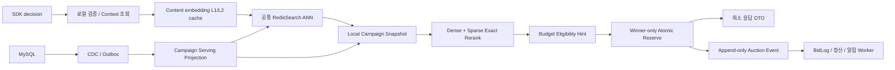
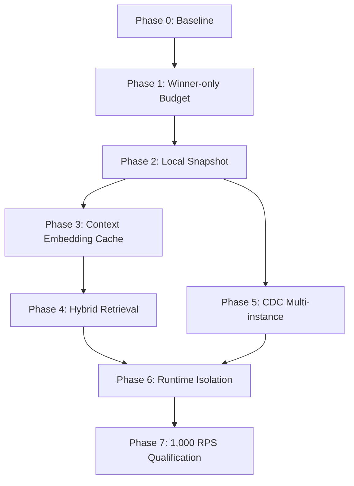
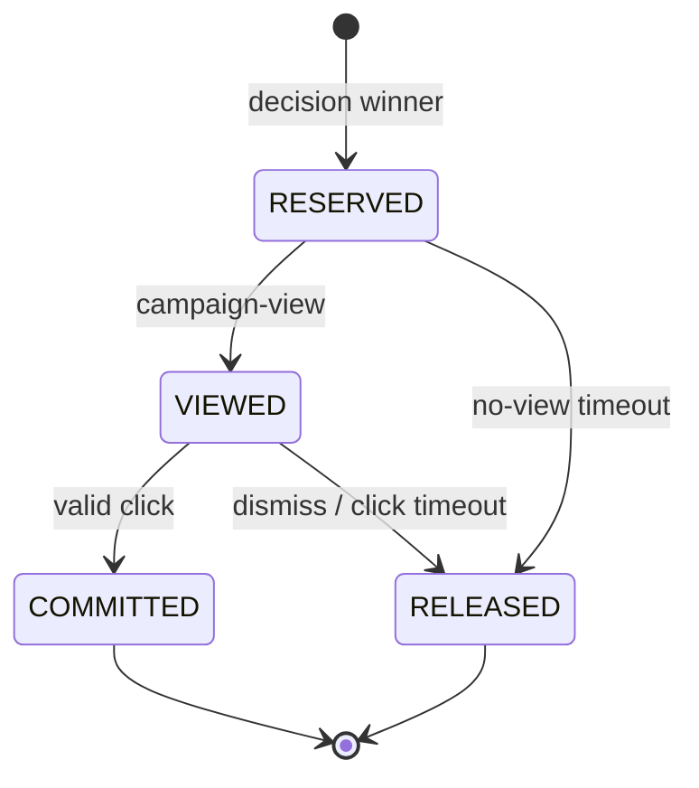

# RTB Serving 경로 1,000 RPS 개선 로드맵

> 작성일: 2026-07-10
> 기준 브랜치: `refactor/ANN-matcher`
> 상태: 실행 준비
> 목표: RTB Serving 컨테이너 1개가 현실적인 요청 분포에서 초당 1,000건을 지속 처리

---

## 1. 먼저 내릴 결론

현재 적용된 ANN을 곧바로 더 튜닝하지 않는다.

ANN은 전체 캠페인 순회를 줄이는 데 이미 필요한 역할을 하고 있다. 하지만 지금 남아 있는 비용은 ANN 검색 하나로 설명되지 않는다.

- request embedding cache miss 시 Node 프로세스 안에서 Transformer 추론이 실행된다.
- ANN이 campaign ID를 줄여도 top-M 캠페인의 전체 RedisJSON과 `embeddingTags`를 다시 읽고 파싱한다.
- 상위 후보 10개를 선예약하고 승자 이외의 후보를 롤백한다.
- decision 이후 view가 오지 않으면 winner 예약을 복구할 정보가 만들어지지 않는다.
- Redis가 campaign cache, vector index, budget mutation, BullMQ까지 함께 담당한다.

따라서 작업 순서는 다음과 같이 잡는다.

```text
현재 ANN 기준선 측정
→ winner-only 예산 예약
→ campaign 상세 데이터 local snapshot
→ content embedding 재사용
→ dense/sparse hybrid retrieval
→ CDC 기반 multi-instance 동기화
→ RTB runtime과 shared dependency 격리
→ 컨테이너당 1,000 RPS qualification
```

ANN 파라미터나 저장소를 바꾸는 것은 위 비용을 제거한 뒤에도 `FT.SEARCH`가 지배적인 병목으로 남을 때 결정한다.

---

## 2. 목표를 어떻게 정의할 것인가

### 2.1 “1,000 RPS 처리”의 의미

단순히 HTTP 200 응답을 초당 1,000개 반환하는 것만으로 성공으로 보지 않는다.

다음 조건을 함께 만족해야 한다.

| 구분 | 필수 기준 | 권장 기준 |
|---|---:|---:|
| 완료 처리량 | `1,000 completed requests/s` | 동일 |
| Dropped iteration | `0` | 동일 |
| 오류율 | `< 0.1%` | 동일 |
| HTTP p95 | `< 300ms` | `< 100ms` |
| HTTP p99 | 관측·기록 | `< 200ms` |
| 지속 시간 | 10분 | 30분 soak test |
| RTB CPU | 발산하지 않음 | `< 75%` |
| RSS/Heap | 지속 상승 없음 | 안정 plateau |
| Event loop lag | 발산하지 않음 | p99 기준 관리 |
| BidLog queue | backlog 발산 없음 | 부하 종료 후 즉시 drain |
| 예산 정합성 | 초과 차감·유실 없음 | 동일 |

### 2.2 기준 자원

초기 qualification은 현재 로컬 compose 기본값을 따른다.

```text
RTB 컨테이너: 2 vCPU / 4GB
Campaign dataset: 1,000개
RedisSearch: 동일 네트워크 영역
MySQL/Redis/Worker: RTB 컨테이너 외부 의존성
```

결과에는 반드시 다음을 함께 기록한다.

- CPU와 RAM 제한
- Node 버전과 프로세스 수
- campaign/vector 문서 수
- ANN `top-L`, `top-M`, campaign별 hit limit
- request pool 크기와 embedding cache 상태
- worker 실행 여부와 concurrency
- Redis 메모리 제한과 eviction 정책

### 2.3 API 처리량과 시스템 처리량을 구분한다

```text
API capacity
= RTB가 응답을 반환할 수 있는 속도

Sustainable system capacity
= RTB + RedisSearch + Budget Redis + Event Queue + Worker + MySQL이
   backlog 없이 계속 처리할 수 있는 속도
```

최종 capacity는 모든 구성요소 중 가장 낮은 처리량으로 결정한다.

---

## 3. 현재까지 확인된 사실

### 3.1 ANN 적용 후 유효한 부하 결과

ANN 인덱스 OOM을 복구하고 campaign이 정상 반환되는 상태에서 다음 결과가 기록되어 있다.

| 시나리오 | 요청 Rate | 결과 | 해석 |
|---|---:|---|---|
| Fixed input | 30 RPS | `p95=5.29ms` | embedding과 검색 결과가 매우 잘 캐시된 best case |
| Random pool | 30 RPS | `p95=2.04s`, `55 dropped`, `29.01 RPS` | 실제 요청 다양성에서 이미 tail cliff 발생 |

Fixed 결과만으로 현재 구조가 수백 RPS를 처리한다고 판단할 수 없다. Random pool 결과 기준으로는 30 RPS가 넉넉한 구간이 아니다.

### 3.2 과거 부하 결과를 해석할 때 주의할 점

과거 동일 코드에서도 빠른 결과와 수초대 결과가 모두 관찰됐다. 주요 원인은 다음과 같다.

1. decision-only 테스트가 winner Spent를 계속 누적했다.
2. 예산이 줄면서 reserve 성공 후보와 rollback 대상이 감소했다.
3. 후보가 줄어든 빠른 실패 경로를 성능 개선으로 오해할 수 있었다.
4. ANN vector key가 존재해도 RediSearch index는 OOM으로 `num_docs=0`일 수 있었다.
5. BullMQ 완료 job retention이 Redis 메모리를 사용해 vector index와 경쟁할 수 있었다.

따라서 부하테스트 결과에는 요청 성공 여부뿐 아니라 다음 값이 반드시 포함되어야 한다.

```text
ANN index health
matched candidates
reserve attempted candidates
reserved candidates
rollback candidates
fallback/error 분포
queue waiting/active/delayed
budget 상태 변화
```

### 3.3 현재 요청 경로

```text
BlogKey Redis 조회
→ request tags canonicalization
→ request embedding cache 조회
   └─ miss: Xenova Transformer inference
→ RedisSearch campaign-tag ANN
→ tag hit를 campaign ID로 group-by
→ top-M campaign RedisJSON 조회
→ embeddingTags JSON.parse
→ exact tag-wise rerank
→ candidate 전체 score 정렬
→ 상위 10개 budget increment
→ 성공 후보 재정렬
→ winner 1개 선택
→ loser budget decrement
→ auction Redis 저장
→ BullMQ job enqueue 대기
→ DTO 변환·중복 JSON serialization
→ HTTP 응답
```

### 3.4 현재 요청당 비용이 커지는 지점

| 구간 | 현재 비용 | 확장 시 문제 |
|---|---|---|
| Request embedding | cache miss마다 모델 추론 | context 조합 수가 늘면 CPU tail 증가 |
| ANN result hydrate | top-M 전체 RedisJSON 조회 | Redis ops, 네트워크 bytes, JSON.parse, GC 증가 |
| Reserve | 최대 10개 EVAL | Redis single-thread와 전역 p-limit 대기 |
| Rollback | 최대 9개 EVAL | 불필요한 mutation과 정합성 위험 |
| Auction/BidLog | Redis 저장 + BullMQ add 대기 | shared Redis contention |
| Response | 전체 winner 객체 생성 후 DTO 필터 | 불필요한 객체 할당과 직렬화 |

---

## 4. 목표 아키텍처



### 4.1 데이터 배치 원칙

| 데이터 | 위치 | 이유 |
|---|---|---|
| Campaign 상세·태그·rerank vector | RTB 인스턴스 local snapshot | 읽기 빈도가 높고 변경 빈도가 낮음 |
| Dense ANN index | 초기에는 RedisSearch | 멀티 인스턴스가 공통 index와 filter 사용 |
| Context embedding | local L1 + shared L2 | 동일 게시글 반복 추론 제거 |
| `reserved`, `spent`, budget | Redis | 원자성·동시성 제어 필요 |
| Reservation/Auction | Redis | TTL·멱등성·빠른 후속 조회 필요 |
| Campaign 영속 상태 | MySQL | Source of Truth |
| Bid/View/Click event | Kafka 또는 Redis Stream | append-only 후단 처리 |
| 분석/조회 로그 | MySQL | 비동기 batch 저장 |

### 4.2 정상 warm request가 도달해야 할 형태

```text
contextId 조회
→ embedding L1 hit
→ RedisSearch ANN 1회
→ local Map에서 campaign hydrate
→ local rerank
→ Redis winner-only reserve 1회
→ auction/event 기록
→ 최소 DTO 응답
```

정상 요청에서 제거할 작업은 다음과 같다.

- runtime Transformer inference
- top-M `JSON.GET`
- `embeddingTags` JSON parse
- 10개 speculative reserve
- loser rollback
- 전체 campaign 객체 응답 변환

---

## 5. 핵심 설계 결정

### 결정 1. ANN은 유지하되, 지금은 교체하지 않는다

장기적으로 제목과 본문을 사용하는 semantic matching이 목표이므로 dense vector retrieval은 필요하다.

현재 단계에서는 RedisSearch ANN을 공통 retrieval 계층으로 유지한다.

다음 조건을 모두 만족한 뒤에도 `FT.SEARCH`가 지배적 병목이면 다른 backend를 비교한다.

```text
request embedding 중복 생성 제거 완료
top-M RedisJSON hydrate 제거 완료
budget fan-out 제거 완료
queue/shared Redis contention 분리 완료
```

비교 후보는 다음과 같다.

- local exact scan
- versioned local HNSW
- RedisSearch cluster
- 전용 Vector DB

### 결정 2. 태그 역인덱스는 ANN 대체가 아니라 sparse signal이다

현재 auto SDK의 닫힌 tag vocabulary에는 태그 역인덱스가 빠르다. 그러나 자유 텍스트 context까지 전역 matcher를 태그 방식으로 바꾸면 장기 목표와 충돌한다.

```text
Dense signal
= title/body semantic vector similarity

Sparse signal
= exact tags + alias + keyword/BM25

Business signal
= CPC + intent + 정책 점수
```

auto tag-only 요청에는 기존 tag matrix fast path를 선택적으로 사용할 수 있다.

### 결정 3. Multi-instance여도 local snapshot을 사용한다

모든 RTB 인스턴스가 동일한 snapshot 복제본을 가진다.

```text
RTB Instance A → Snapshot v42
RTB Instance B → Snapshot v42
RTB Instance C → Snapshot v42
```

Redis는 bootstrap·ANN·budget에 남고, campaign 상세 read는 local memory에서 수행한다.

### 결정 4. Campaign static status와 Budget eligibility를 분리한다

```text
CampaignStatus
= ACTIVE | PAUSED_BY_USER | ENDED

BudgetEligibility
= AVAILABLE | DAILY_EXHAUSTED | TOTAL_EXHAUSTED
```

예산 때문에 ANN vector document를 매 요청 삭제·재생성하지 않는다. 빠른 budget hint로 후보를 제외하고 최종 reserve에서 다시 검증한다.

### 결정 5. 과금 상태는 `spent`와 `reserved`로 분리한다

```text
available = budget - spent - reserved
```

- `reserved`: 아직 click으로 확정되지 않은 금액
- `spent`: 과금 이벤트가 확정된 금액

현재 `dailySpent` 하나에 임시 선점과 확정 금액을 섞는 구조를 장기적으로 유지하지 않는다.

### 결정 6. CDC는 local snapshot의 유일한 복구 수단이 준비된 뒤 RedisJSON을 제거한다

CDC delta만으로는 신규 인스턴스가 과거 전체 campaign을 복원할 수 없다.

다음이 준비되어야 한다.

- initial snapshot
- snapshot 시점의 offset/watermark
- delta replay
- version/sequence gap 감지
- 전체 reload
- catch-up 이후 readiness

그전까지 Redis campaign cache는 bootstrap source로 유지할 수 있다. 다만 hot path에서는 읽지 않는다.

---

## 6. 전체 실행 순서

| Phase | 주제 | 가장 먼저 없애는 비용 | 주요 산출물 |
|---:|---|---|---|
| 0 | 현재 ANN 기준선 | 측정 불확실성 | rate sweep, stage profile |
| 1 | Winner-only budget | reserve/rollback fan-out | reservation 상태 머신, Lua |
| 2 | Local campaign snapshot | top-M RedisJSON hydrate | versioned snapshot, local rerank |
| 3 | Content-addressed embedding | request inference miss | contextId, content hash, L1/L2 cache |
| 4 | Hybrid retrieval | semantic/lexical 품질 한계 | dense+sparse fusion, offline evaluation |
| 5 | CDC multi-instance sync | RedisJSON bootstrap 의존 | serving projection, replay/readiness |
| 6 | Serving runtime 격리 | event loop·shared Redis contention | 전용 entrypoint, event pipeline |
| 7 | 1,000 RPS qualification | 미검증 capacity | 10분 steady-state 증거 |



---

## 7. Phase 0 — 현재 ANN 기준선과 포화 지점 확정

### 왜 가장 먼저 하는가

현재 유효한 realistic 결과는 random pool `30 RPS / p95=2.04s`까지다. 이 수치만으로 ANN search, request inference, JSON hydrate, budget, queue 중 무엇이 주 병목인지 확정할 수 없다.

> 2026-07-10 추가: ANN ON/OFF A/B(`RATE=30/60`)를 실행했다. Random 30에서 ANN ON p95가 1.40s→550ms로 개선됐지만, Random 60은 OFF/ON 모두 reserve/rollback cliff였다. 상세는 `_docs/worklog/2026-07-10_ann-matcher-ab-loadtest.md`.

### 실행할 테스트

```text
RATE=5/10/15/20/25/30
→ 안정 구간과 첫 cliff 확인

그다음
RATE=50/100/250...
→ 앞 단계 개선 후 확장
```

초기부터 1,000 RPS를 넣어 전체가 무너지는 결과만 얻지 않는다.

### 요청 프로필

1. `fixed-cache-hot`
   - 동일 태그·동일 post URL
   - embedding/cache 상한 확인용
2. `random-tag-pool`
   - 기존 1,000 request pool
   - 현재 SDK 형태의 realistic tail 확인용
3. `stable-budget`
   - 테스트 중 budget distribution이 변하지 않도록 충분한 예산 사용
4. `exhausted-heavy`
   - 소진 후보가 상위 결과를 차지하는 최악 조건
5. `full-lifecycle`
   - decision → view → click 또는 dismiss/TTL

### 필수 메트릭

```text
HTTP
- completed RPS
- p50/p95/p99/max
- dropped iterations
- error/fallback

Runtime
- CPU
- RSS/heap
- GC pause
- event loop lag

Embedding
- L1/L2 hit/miss
- single-flight wait
- inference duration

Retrieval
- FT.SEARCH duration
- ANN hit count
- retrieved campaign count
- Redis response bytes
- local/external hydrate duration

Budget
- attempted candidates
- window count
- reserve success/reject
- rollback count
- EVAL/request

Downstream
- queue enqueue duration
- waiting/active/delayed
- worker throughput
- MySQL batch duration
```

### 완료 조건

- fixed/random 각각의 안전 RPS와 cliff가 표로 남는다.
- 전체 p95를 가장 많이 설명하는 stage가 확인된다.
- Phase 1 전후 비교에 사용할 동일 명령과 dataset version이 고정된다.

---

## 8. Phase 1 — Winner-only Reservation과 Budget 상태 모델

> 2026-07-10: Phase 1A로 10개 window 단위 winner-only Lua, loser rollback 제거, legacy flag, 단위·동시성 검증을 완료했다. 상세는 `_docs/tasks/2026-07-10_rtb-phase1a-winner-only-reservation.md`와 `_docs/worklog/2026-07-10_rtb-phase1a-winner-only-reservation.md`를 참조한다. Reserved/Committed 상태 분리와 auctionId 멱등성·TTL 전이는 Phase 1B로 남아 있다.

### 해결하려는 문제

현재는 top-K 10개를 모두 예약하고, 예산을 확보한 후보 중 승자 1개를 선택한 다음 패배 후보를 롤백한다.

```text
최대 10 increment
+ 최대 9 decrement
= 요청당 최대 19 budget EVAL
```

선택 기준이 이미 score/maxCpc/tie-break 순으로 정해져 있으므로, 예산 가능한 가장 높은 순위 후보 1개만 예약하면 된다.

### 목표 흐름

```text
후보 순위를 애플리케이션에서 완전히 확정
→ Redis에서 순위순 budget 검사
→ 첫 성공 후보 1개만 reserved 증가
→ 즉시 winner 반환
→ loser rollback 없음
```

### 예약 상태 모델



### 원자 연산에 포함할 항목

```text
auctionId 멱등성 확인
→ campaign status/blocked 확인
→ daily/total available 확인
→ reserved 증가
→ reservation:{auctionId} 생성
→ eligibility 재계산
→ winner ID 반환
```

### Budget eligibility 판정

```text
dailyAvailable = dailyBudget - dailySpent - dailyReserved
totalAvailable = totalBudget - totalSpent - totalReserved

dailyAvailable < maxCpc
→ DAILY_EXHAUSTED

totalAvailable < maxCpc
→ TOTAL_EXHAUSTED
```

잔액이 0이 아니더라도 다음 입찰 금액을 지불할 수 없으면 후보에서 제외한다.

### 반드시 처리할 경계 조건

- Redis 실행은 완료됐지만 API가 timeout된 경우의 재시도
- 같은 `auctionId` 중복 decision
- 동일 score/maxCpc 후보의 tie-break 공정성
- decision 이후 view 미도착
- view 이후 click 미도착
- dismiss와 click 동시 도착
- 중복 click
- daily reset과 reserve 경합
- budget 증액/maxCpc 수정과 eligibility 갱신
- reservation TTL expired event 유실

### 완료 조건

- 정상 요청에서 loser rollback count가 0이다.
- 첫 예산 가능 후보와 기존 winner의 agreement가 허용 기준을 충족한다.
- concurrent test에서 `spent + reserved > budget`이 발생하지 않는다.
- no-view 예약이 TTL 이후 복구된다.
- reserve p95와 Redis EVAL/request가 before보다 유의미하게 감소한다.

### 롤백 전략

```text
RTB_BUDGET_MODE=legacy_topk
RTB_BUDGET_MODE=winner_only
RTB_BUDGET_MODE=shadow
```

Shadow에서는 실제 mutation은 한 경로만 수행하고, 다른 경로는 winner 계산 결과만 비교한다.

---

## 9. Phase 2 — RedisSearch ANN과 Local Campaign Snapshot 결합

### 해결하려는 문제

ANN은 ID 수를 줄였지만, 요청마다 top-M 전체 campaign JSON을 Redis에서 다시 가져온다.
Redis의 ANN 인덱스는 캠페인의 상세 정보는 가지고있지않고 벡터거리 계산을 위한 간소화된 정보만 가지고 있기 때문에, 전체정보를 위해서 다시 조회가 필요함. but 이 비용이 어느정도 영향을 끼침

```text
FT.SEARCH
→ JSON.GET x top-M
→ embeddingTags JSON.parse
→ candidate 객체 생성
```

### 목표 흐름

```text
RedisSearch
→ campaign ID + tag/distance만 반환

RTB Local Snapshot
→ campaignsById.get(id)
→ exact rerank
→ response hydrate
```

### Snapshot 내용

```ts
type CampaignServingSnapshot = {
  version: number;
  campaignsById: Map<string, ServingCampaign>;
  tagIndex: Map<string, ReadonlySet<string>>;
  builtAt: number;
};

type ServingCampaign = {
  id: string;
  userId: number;
  status: 'ACTIVE' | 'PAUSED' | 'ENDED';
  startTs: number;
  endTs: number;
  isHighIntent: boolean;
  maxCpc: number;
  tags: readonly string[];
  tagEmbeddings: readonly Float32Array[];
  title: string;
  content: string;
  image: string;
  url: string;
};
```

`number[]`보다 `Float32Array`를 우선 사용해 vector 메모리와 GC 부담을 줄인다.

### 초기 갱신 방식

CDC를 바로 전제하지 않는다.

```text
서버 시작
→ Redis campaign cache 전체 1회 로드
→ snapshot/index build
→ readiness open

운영 중
→ version 확인 또는 update event
→ 새 snapshot build
→ atomic reference swap
```

### 일관성 안전장치

- snapshot version
- 이전 snapshot을 요청 처리 중 직접 mutate하지 않음
- build 완료 후 참조 교체
- stale campaign 긴급 차단을 위한 작은 Redis blocked set
- 최종 winner reserve에서 status/budget 재검증

### 완료 조건

- 정상 decision에서 `findCampaignCachesByIds()` 호출이 0회다.
- ANN ID 결과와 local hydrate 결과의 winner가 기존 경로와 일치한다.
- Redis bytes/request와 JSON.parse CPU가 감소한다.
- snapshot reload 중 요청 오류나 partial index 노출이 없다.
- 신규 컨테이너는 snapshot build 완료 전 readiness를 열지 않는다.

### 롤백 전략

```text
RTB_CAMPAIGN_SOURCE=redis_json
RTB_CAMPAIGN_SOURCE=local_snapshot
```

---

## 10. Phase 3 — Content-addressed Context Embedding

### 해결하려는 문제

향후 제목·본문을 받더라도 매 decision마다 Transformer inference를 수행하면 1,000 RPS를 달성하기 어렵다.

블로그 글은 같은 콘텐츠로 반복 요청되므로 임베딩은 콘텐츠 버전당 한 번만 만든다.

### API 방향

```text
최초 context 등록
POST /api/sdk/context
→ title/body/tags 정규화
→ 서버에서 contentHash 계산
→ embedding 생성 또는 기존 값 재사용
→ contextId 반환

반복 decision
POST /api/sdk/decision
→ contextId 전달
→ 저장된 embedding 사용
```

### 캐시 키

```text
embedding:{modelVersion}:{contentHash}
```

모델이 바뀌면 같은 콘텐츠도 다른 embedding key를 사용한다.

### 정규화 원칙

- Unicode NFC
- 연속 공백/줄바꿈 축약
- 안정적인 title/body/tag 직렬화
- tag 정렬·중복 제거
- 동적 광고·날짜·UI 텍스트 제거
- 본문 길이 제한 또는 chunk/pooling 규칙 고정

### L1/L2 구조

```text
L1: RTB instance local embedding cache
L2: shared Redis/object/vector context store

L1 miss
→ L2 조회
→ L2 miss만 inference
```

같은 hash의 동시 miss는 single-flight로 하나의 inference만 수행한다.

### 주의할 점

- SDK가 보낸 hash를 최초 저장의 신뢰 기준으로 사용하지 않는다.
- 서버가 콘텐츠를 정규화하고 hash를 계산한다.
- hash는 exact duplicate key이지 semantic near-duplicate 판정이 아니다.
- 본문 원문 저장 여부와 TTL은 개인정보·저작권 정책으로 별도 결정한다.
- embedding miss가 RTB deadline을 넘기면 tag-only 또는 fallback context로 응답한다.

### 완료 조건

- 반복 게시글 decision에서 runtime inference가 발생하지 않는다.
- cache hit/miss와 single-flight wait가 메트릭으로 보인다.
- 모델 버전 변경 시 잘못된 embedding 재사용이 없다.
- context miss storm에서도 RTB p99가 설정한 deadline을 넘지 않는다.

---

## 11. Phase 4 — Dense/Sparse Hybrid Retrieval

### 목표

자유 텍스트 semantic 의미와 명시적인 기술 태그를 함께 사용한다.

### 후보 생성

```text
Dense candidates
→ title/body embedding으로 RedisSearch ANN

Sparse candidates
→ exact tag inverted index
→ alias/keyword
→ 필요 시 BM25
```

### 결과 결합

초기에는 설명 가능한 단순 가중치 또는 RRF를 사용한다.

```text
retrievalScore
= denseSimilarity * W_dense
+ sparseTagScore * W_sparse
+ exactMatchBonus
```

최종 business score는 별도로 유지한다.

```text
finalScore
= relevanceScore
+ CPC/business score
+ intent/policy score
```

### Auto tag-only fast path

기존 `_docs/tasks/2026-03-30_rtb-tag-matrix-fastpath-phase4.md`는 전역 ANN 대체가 아니라 auto SDK 전용 fast path로 재범위화한다.

```text
source=sdk_auto + canonical tags only
→ tag matrix/inverted index fast path 가능

source=free_text/contextId
→ dense ANN + hybrid path
```

### 품질 검증

성능만으로 전환하지 않는다.

- top-K candidate overlap
- winner agreement
- expected campaign recall@K
- no-candidate/fallback 변화
- 캠페인/광고주 분포 왜곡
- 가능하면 CTR/CVR 후속 관측

### 완료 조건

- representative context dataset에서 ANN 단독 대비 품질이 유지 또는 개선된다.
- hybrid rerank가 latency budget 안에 들어온다.
- feature flag로 dense-only/tag-fast/hybrid를 전환할 수 있다.

---

## 12. Phase 5 — CDC 기반 Multi-instance Snapshot 동기화

### 해결하려는 문제

Local snapshot을 여러 RTB 인스턴스에서 사용하려면 모든 인스턴스가 같은 campaign serving state를 재구성할 수 있어야 한다.

### 권장 흐름

```text
MySQL binlog / Outbox
→ CDC
→ Campaign Projection Worker
→ 완성된 CampaignServingDocument event
→ 각 RTB 인스턴스 local snapshot
→ RedisSearch vector projection
```

RTB가 raw row-level CDC를 직접 해석하지 않는다. Campaign, Tag relation, embedding 변경을 합친 완성된 serving document를 발행한다.

### 이벤트 예시

```ts
type CampaignServingEvent =
  | {
      type: 'UPSERT';
      campaignId: string;
      version: number;
      sequence: number;
      campaign: ServingCampaign;
    }
  | {
      type: 'DELETE';
      campaignId: string;
      version: number;
      sequence: number;
    };
```

### 신규 인스턴스 bootstrap

```text
1. Versioned full snapshot 로드
2. snapshot offset 이후 event replay
3. latest offset까지 catch up
4. local index build 완료
5. RedisSearch/index version 확인
6. readiness open
```

### Multi-instance broadcast 주의

모든 RTB 인스턴스는 모든 campaign update를 받아야 한다.

하나의 Kafka consumer group으로 이벤트를 나누면 각 인스턴스가 일부 campaign만 받게 된다. 다음 중 하나를 선택한다.

- 인스턴스별 독립 consumer group
- compacted topic을 각 인스턴스가 독립 replay
- 공통 versioned snapshot + 작은 delta feed
- index artifact 배포 + update notification

### RedisJSON 제거 시점

다음 장애 시나리오를 통과한 후 제거한다.

- 신규 인스턴스 시작
- 이벤트 소비 중 재시작
- sequence gap
- 오래된 update가 늦게 도착
- projection worker 일시 중단
- Kafka/CDC 복구
- full snapshot reload

그전까지 RedisJSON은 bootstrap/fallback으로 남겨도 되지만 normal hot read에서는 사용하지 않는다.

### 완료 조건

- 모든 인스턴스가 동일 snapshot version을 보고한다.
- gap 발생 시 자동으로 reload하거나 readiness를 닫는다.
- Redis campaign JSON 없이 신규 인스턴스 bootstrap이 가능하다.
- campaign update/delete가 정의된 SLA 안에 모든 instance와 RedisSearch에 반영된다.

---

## 13. Phase 6 — RTB Serving Runtime과 Shared Dependency 격리

### 논리적 분리만으로 충분하지 않은 이유

Nest Module이나 폴더만 분리해도 같은 프로세스라면 다음을 공유한다.

- event loop
- heap/GC
- Redis/DB connection pool
- 배포와 재시작
- CPU cgroup

성능 효과를 얻으려면 RTB가 실제로 로드하는 dependency와 실행하는 background task를 줄여야 한다.

### 목표 프로세스

```text
rtb-serving
→ /sdk/decision
→ local snapshot
→ matcher/ranker
→ budget gateway
→ event producer

control-api
→ campaign CRUD
→ admin/query API

campaign-index-worker
→ embedding/index/projection

bidlog-worker
→ event batch 저장/알림
```

동일 Docker image에서 entrypoint만 다르게 시작할 수 있다.

### Shared Redis 역할 분리

현재 RedisSearch OOM 이력과 queue retention 이력이 있으므로 부하가 커지면 역할을 나눈다.

```text
Serving Budget Redis
→ budget/reservation/auction/idempotency

Vector RedisSearch
→ campaign ANN index

Event Redis/Kafka
→ auction/bid/view/click stream
```

분리는 측정 근거에 따라 진행한다. 인프라 개수를 늘리는 것 자체를 목표로 삼지 않는다.

### BidLog 경로

```text
RTB
→ append-only event 1회
→ 응답

Worker
→ 100~500개 batch
→ MySQL bulk insert
→ SSE/통계 후속 처리
```

### Framework/프로세스 튜닝

다음은 구조적 비용 제거 후에 측정한다.

- Nest Express → Fastify
- Node single process → worker/cluster
- JSON serializer 최적화
- response DTO 직접 구성
- Redis connection/pipeline 분리

### 완료 조건

- control-plane bulk 작업이 RTB p99에 유의미한 영향을 주지 않는다.
- queue backlog가 Vector/Serving Redis 메모리와 경쟁하지 않는다.
- RTB 프로세스의 baseline heap과 loaded dependency가 감소한다.
- event worker 중단 시 RTB가 정해진 정책으로 계속 응답하거나 load shedding한다.

---

## 14. Phase 7 — 컨테이너당 1,000 RPS Qualification

### 단계별 rate sweep

구조 개선 후 다음 순서로 올린다.

```text
100 → 250 → 500 → 750 → 1,000 RPS
```

각 단계는 짧은 smoke test 후 10분 steady-state로 확인한다. 첫 saturation 지점에서 무작정 다음 rate로 진행하지 않는다.

### 최종 테스트 매트릭스

| 축 | 값 |
|---|---|
| Request 분포 | fixed / random tag / semantic context |
| Embedding 상태 | L1 hit / L2 hit / controlled miss |
| Budget 상태 | stable / exhausted-heavy / contention |
| Lifecycle | decision-only 진단 / full click / dismiss / timeout |
| Campaign 수 | 1K / 10K 확장 테스트 |
| Instance 수 | 1 / 2+ 일관성 테스트 |
| Dependency | 정상 / Redis 지연 / queue backlog / CDC lag |

### 통과 판정

1,000 RPS에서 다음이 모두 맞아야 한다.

- 10분 동안 실제 completed RPS가 1,000에 도달
- dropped iteration 0
- error rate 0.1% 미만
- p95 300ms 미만
- CPU/RSS/event loop lag가 시간에 따라 악화되지 않음
- RedisSearch와 Budget Redis queueing이 발산하지 않음
- BidLog queue backlog가 지속 증가하지 않음
- budget invariant 위반 없음
- campaign snapshot version drift 없음
- relevance quality gate 통과

### Capacity 산정

운영 safe RPS는 부하테스트 최대 통과 지점을 그대로 사용하지 않는다.

```text
운영 safe capacity
= 첫 saturation 이전 안정 처리량의 약 60~70%
```

예를 들어 1,000 RPS를 통과하지만 CPU가 95%라면 컨테이너당 운영 capacity를 1,000으로 잡지 않는다.

---

## 15. 장애·정합성 시나리오

### ANN index OOM 또는 empty index

```text
FT.INFO health check 실패
→ readiness close 또는 safe fallback
→ 빠른 빈 성공 응답으로 성능 수치를 오염시키지 않음
```

필수 health 항목:

- `num_docs`
- indexing failure
- background indexing status
- expected vector count/version

### Redis reserve timeout

Redis에서는 예약이 완료됐지만 API가 timeout될 수 있다.

```text
retry with same auctionId
→ 기존 reservation/winner 반환
→ 중복 reserved 증가 금지
```

### CDC lag 또는 snapshot drift

```text
event sequence gap
→ readiness close
→ full snapshot reload
→ latest offset catch-up
→ readiness reopen
```

### Campaign 긴급 중지

Local snapshot 반영이 늦을 수 있으므로 작은 global blocked set을 최종 reserve에서 검사한다.

```text
local snapshot: ACTIVE
Redis blocked set: present
→ reserve 거절
```

### Event worker 중단

- event append 성공 여부를 RTB 성공 조건에 포함할지 정책화한다.
- queue가 full이면 무제한 메모리 적체 대신 backpressure/load shedding을 적용한다.
- worker 재시작 후 idempotent batch 저장이 가능해야 한다.

---

## 16. 변경을 섞지 않기 위한 결정 게이트

### Gate A — ANN 파라미터를 지금 바꿀 것인가

다음 질문에 `예`일 때만 조정한다.

- `match_ann_search`가 전체 p95의 지배 구간인가?
- request embedding miss를 분리한 뒤에도 ANN이 느린가?
- top-M JSON hydrate를 제거한 뒤에도 ANN이 느린가?
- recall/winner quality를 측정할 dataset이 있는가?

### Gate B — Local HNSW로 갈 것인가

다음을 함께 비교한다.

| 기준 | Local HNSW | RedisSearch/Vector DB |
|---|---|---|
| 단건 latency | 유리 | 네트워크 비용 존재 |
| Multi-instance sync | 직접 구현 | 공통 index로 단순 |
| Upsert/delete | 구현 복잡 | 상대적으로 쉬움 |
| Filter | 별도 구현 가능성 | metadata filter 지원 |
| Warm-up | index load 필요 | 없음 |
| 장애 복구 | artifact/version 관리 | 저장소가 담당 |

단건 latency만으로 결정하지 않는다.

### Gate C — Redis campaign JSON을 삭제할 것인가

다음이 모두 검증된 뒤 삭제한다.

- durable initial snapshot
- CDC replay
- version/gap recovery
- 신규 instance readiness
- snapshot rebuild 시간 SLA
- Redis 없는 bootstrap 테스트

그전에는 저장을 남겨도 되지만 hot path read는 제거한다.

### Gate D — Tag fast path를 기본값으로 둘 것인가

auto SDK 비율과 free-text context 비율을 먼저 측정한다.

- canonical tag-only 요청: tag matrix fast path 후보
- title/body context 요청: dense/hybrid path
- 알 수 없는 source: semantic safe path 또는 명시적 fallback

---

## 17. 바로 시작할 작업

### 첫 번째 작업 단위: Phase 0 baseline

- [x] ANN ON/OFF A/B (`RATE=30/60`, Fixed/Random) 1차 측정 완료 — `_docs/tasks/2026-07-10_ann-matcher-ab-loadtest.md`, `_docs/worklog/2026-07-10_ann-matcher-ab-loadtest.md`
- [ ] ANN index health를 확인하는 preflight 추가
- [ ] 현재 `RATE=5/10/15/20/25/30` random-pool sweep 실행
- [ ] fixed-input 동일 sweep 실행
- [ ] embedding hit/miss 메트릭 추가
- [ ] Redis campaign hydrate bytes/latency 계측
- [ ] request당 budget EVAL 수 계측
- [ ] BidLog queue throughput/backlog 기록
- [ ] CPU/RSS/event loop lag와 k6 결과 타임라인 정렬

### 두 번째 작업 단위: Phase 1 상세 Task 분리

- [ ] 현재 decision/view/click/dismiss/TTL 상태 전이 테스트 작성
- [ ] `reserved/spent` 필드와 migration 범위 정의
- [ ] winner-only Lua 입출력 계약 작성
- [ ] auctionId idempotency 규칙 작성
- [ ] daily/total eligibility set 또는 state 구조 정의
- [ ] legacy/shadow/winner-only feature flag 정의

### 첫 실행 이후 문서화할 값

```text
안전 RPS:
첫 saturation RPS:
주 병목 stage:
request embedding hit rate:
FT.SEARCH p95:
campaign hydrate p95/bytes:
reserve p95/EVAL per request:
queue producer/consumer RPS:
CPU/RSS/event loop p99:
```

---

## 18. 관련 코드와 기존 문서

### 주요 코드

- `backend/src/rtb/rtb.service.ts`
  - match → reserve → select → rollback → auction → queue 제어 흐름
- `backend/src/rtb/matchers/xenova.matcher.ts`
  - request embedding, ANN retrieval, top-M hydrate, exact rerank
- `backend/src/campaign/repository/redis-campaign.cache.repository.ts`
  - RedisJSON, RedisSearch HNSW, budget increment/decrement
- `backend/src/campaign/scripts/lua-script.ts`
  - 현재 Spent 원자 증감
- `backend/src/sdk/sdk.service.ts`
  - view/click/dismiss와 rollback lifecycle
- `backend/src/worker/redis-ttl.worker.ts`
  - rollback TTL 만료 처리
- `backend/src/bidlogworker/save-bidlog.worker.ts`
  - BidLog 후단 저장
- `.loadtest/k6/http/rtb-decision.js`
  - fixed-input profile
- `.loadtest/k6/http/rtb-decision-random-pool.js`
  - request diversity profile

### 기존 문서

- `_docs/tasks/2026-03-28_rtb-loadtest-capacity-cliff-1000-campaigns.md`
- `_docs/tasks/2026-03-29_rtb-bounded-fanout-phase1.md`
- `_docs/tasks/2026-03-29_rtb-fanout-observability-phase2.md`
- `_docs/tasks/2026-03-29_rtb-match-n-reduction-phase3.md`
- `_docs/worklog/2026-03-29_rtb-match-n-reduction-phase3.md`
- `_docs/tasks/2026-03-30_rtb-tag-matrix-fastpath-phase4.md`
- `_docs/tasks/2026-03-08_context-matching-lightweight-baseline-and-upgrade.md`
- `_docs/worklog/2026-03-06_rtb-go-grpc-split-poc.md`

---

## 19. 문서 운영 방법

이 문서는 전체 방향을 고정하는 umbrella roadmap으로 사용한다.

- 각 Phase는 별도 Task와 PR로 분리한다.
- 구현을 시작하면 `_docs/worklog/2026-07-10_rtb-serving-1000-rps-roadmap.md`에 phase별 의사결정과 raw 결과를 누적한다.
- Phase가 끝날 때마다 이 문서의 통과 기준과 실제 결과를 비교한다.
- 앞 단계의 병목이 예상과 다르면 순서를 바꾸되, 변경 이유와 근거 메트릭을 Worklog에 기록한다.
- 1,000 RPS에 도달했더라도 quality, budget invariant, queue sustainability가 깨지면 완료로 처리하지 않는다.
